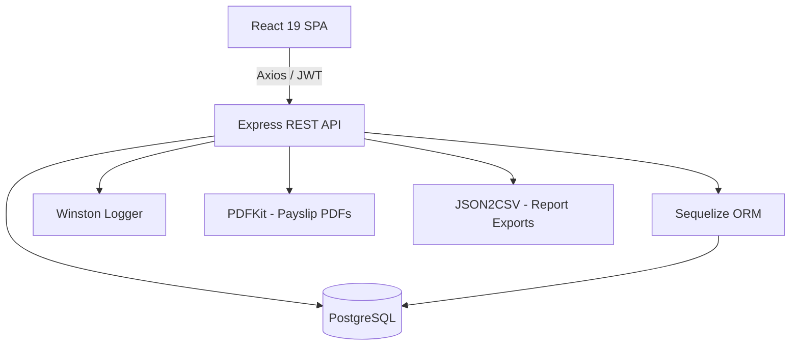
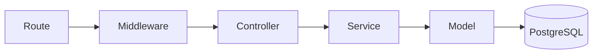
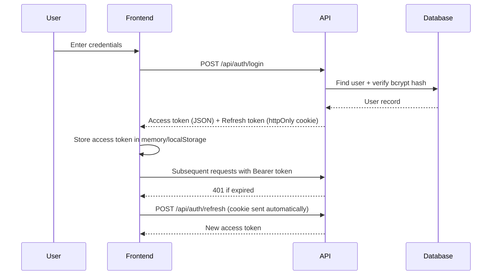
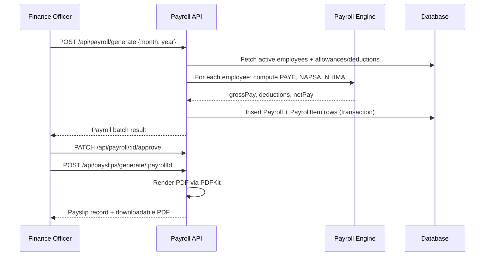

# Architecture Documentation

## System Overview

## Backend Layering

- **Routes** — declare endpoints, wire up validators and role guards, delegate to controllers
- **Middleware** — authentication (JWT verify), authorization (role check), validation (express-validator results), centralized error handling, audit logging
- **Controllers** — thin HTTP layer: parse request, call service, format response via `ApiResponse`
- **Services** — business logic (payroll calculations, employee lifecycle, report aggregation) — framework-agnostic, easily unit-testable
- **Models** — Sequelize definitions + associations, one file per table

## Auth Flow

## Payroll Generation Flow

## Security Measures

- Passwords hashed with bcrypt (cost factor 12)
- JWT access tokens (short-lived) + refresh tokens (httpOnly, sameSite cookie)
- Role-based authorization on every protected route (`Administrator`, `HR Officer`, `Finance Officer`)
- `helmet` for secure HTTP headers, `cors` locked to the configured client origin
- Rate limiting on the login endpoint (20 requests / 15 min)
- express-validator on all mutating endpoints
- Centralized error handler normalizes Sequelize/JWT errors into consistent API responses without leaking stack traces in production
- Full audit trail (`audit_logs`) for create/update/delete/login/logout/payroll-run actions
