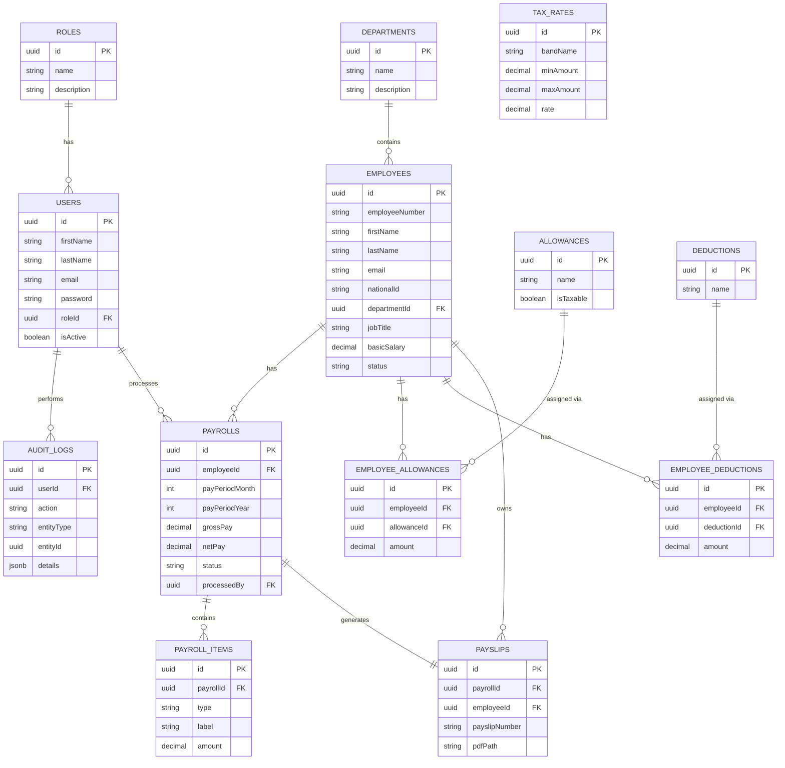

# Database Documentation

## ER Diagram

## Normalization Notes

- **Allowances/Deductions are catalogs**, separate from `EmployeeAllowance`/`EmployeeDeduction` join tables — this avoids repeating allowance names/tax rules on every employee row and lets HR add a new allowance type once, globally.
- **PayrollItem** stores a line-item snapshot at the moment payroll was run. Even if an employee's allowance amount changes later, historical payslips remain accurate because the amount was copied into `payroll_items`, not re-derived from `employee_allowances`.
- **TaxRate** is a versioned table (`effectiveFrom`/`effectiveTo`/`isActive`) so PAYE bands can change year to year without losing history of what rates applied to past payroll runs.
- **Payroll** has a unique composite index on `(employeeId, payPeriodMonth, payPeriodYear)` — the database itself prevents double-processing the same employee for the same period.
- **AuditLog** uses `entityType` + `entityId` as a generic polymorphic reference rather than a separate audit table per entity, since audit requirements are the same shape for every entity.

## Statutory Calculations (illustrative defaults)

- **NAPSA**: 5% of basic salary, capped at a monthly ceiling (`NAPSA_CEILING` in `config/constants.js`)
- **NHIMA**: 1% of gross pay
- **PAYE**: progressive bands stored in `tax_rates`, seeded with placeholder Zambian-style bands

> These are configurable, illustrative defaults — verify current ZRA/NAPSA/NHIMA rates before using in a real payroll run, and update the `tax_rates` table (or seed data) accordingly.
