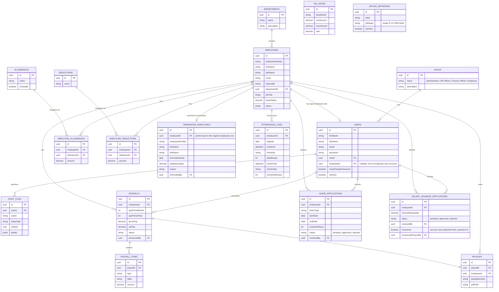

# Database Documentation

## ER Diagram



## Normalization Notes

- **Allowances/Deductions are catalogs**, separate from `EmployeeAllowance`/`EmployeeDeduction` join tables — this avoids repeating allowance names/tax rules on every employee row and lets HR add a new allowance type once, globally.
- **PayrollItem** stores a line-item snapshot at the moment payroll was run. Even if an employee's allowance amount changes later, historical payslips remain accurate because the amount was copied into `payroll_items`, not re-derived from `employee_allowances`.
- **TaxRate** is a versioned table (`effectiveFrom`/`effectiveTo`/`isActive`) so PAYE bands can change year to year without losing history of what rates applied to past payroll runs.
- **Payroll** has a unique composite index on `(employeeId, payPeriodMonth, payPeriodYear)` — the database itself prevents double-processing the same employee for the same period.
- **AuditLog** uses `entityType` + `entityId` as a generic polymorphic reference rather than a separate audit table per entity, since audit requirements are the same shape for every entity.
- **Users ↔ Employees is a nullable one-to-one, open to any role.** Any staff account (Admin/HR/Finance) can optionally link `employeeId` too — not just the `Employee` role — since HR/Finance/Admin staff are frequently employees of the company as well. Only the `Employee` role *requires* the link (an Employee-role account with no linked record couldn't do anything). The unique constraint on `users.employeeId` guarantees at most one login per employee — the API enforces this at creation time, not just the DB.
- **LeaveApplication/SalaryAdvanceApplication** intentionally mirror the same shape (`status`, `reviewedBy`, `reviewedAt`, `reviewComment`) even though they're reviewed by different roles (HR vs Finance) — kept as separate tables rather than one polymorphic "request" table because their domain-specific fields (`leaveType`/date range vs `amountRequested`) differ enough that a shared table would need a lot of nullable columns. `SalaryAdvanceApplication` additionally tracks `recovered`/`recoveredInPayrollId` so the payroll engine can automatically apply it exactly once as a payroll deduction.
- **TerminatedEmployee is an archive, not a replacement for the employees row.** Terminating an employee writes a snapshot here (for HR record-keeping) and flips `employees.status` to `terminated` - it does **not** delete the `employees` row. That row is still the foreign-key target for the employee's historical `Payroll`, `Payslip`, `LeaveApplication`, and `SalaryAdvanceApplication` records; deleting it would either be rejected (FK constraint) or cascade-delete years of payroll history, neither of which is acceptable for a payroll system. "Removed from the active list" is enforced at the query level instead - default employee listings and the dashboard headcount both filter out `status = 'terminated'`.
- **AttendanceLog is one row per employee per day**, not one row per clock action. Clock-in creates it, clock-out fills in the rest - this makes "did they clock out?" a single nullable-column check (`clockOutAt IS NULL`) instead of needing to pair up rows from an event-log table. `lateMinutes`/`overtimeMinutes` are computed once and stored (not derived on read), so a later change to the standard work-hours config doesn't rewrite history.
- **OfficeNetwork is deliberately a table, not an env var.** IP allowlisting needs to be editable by an Administrator without a redeploy (offices move, IPs change, a company might add a second location or a VPN range) - `isActive` lets an entry be disabled without losing the record of what it was.

## Statutory Calculations (ZRA method)

```
grossPay      = basicSalary + all allowances
NAPSA         = 5% of grossPay
NHIMA         = 1% of basicSalary
taxableIncome = grossPay - NAPSA - NHIMA
PAYE          = progressive tax on taxableIncome, per the active tax_rates bands
```

- **NAPSA**: 5% of gross earnings (basic + all allowances). No statutory ceiling is currently modeled - real NAPSA registration does apply one to pensionable earnings; add it back in `payrollCalculator.js` if your organization needs it.
- **NHIMA**: 1% of basic salary only (allowances are excluded from this one).
- **PAYE**: progressive bands stored in `tax_rates`, seeded with the 2025 ZRA bands: 0% to K5,100, 25% to K9,200, 30% to K18,000, 37% above.

> Verify current ZRA/NAPSA/NHIMA rates periodically — these change with government budget cycles — and update the `tax_rates` table (or seed data) accordingly. If you've already run the original seeders against a live database, re-seed `tax_rates` to pick up the corrected bands: `npx sequelize-cli db:seed:undo --seed 20250101100004-seed-tax-rates.js && npx sequelize-cli db:seed --seed 20250101100004-seed-tax-rates.js`.
